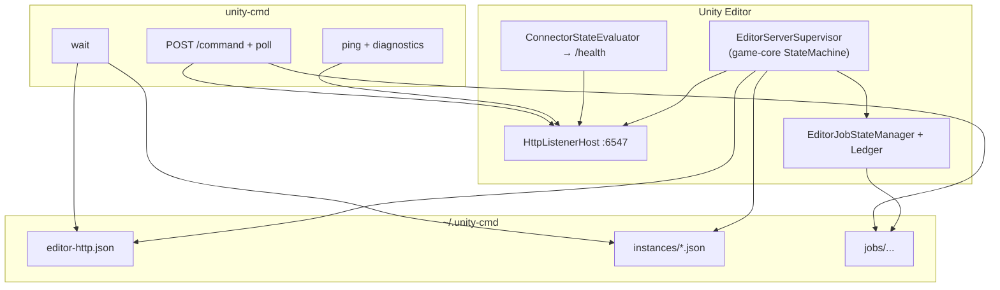
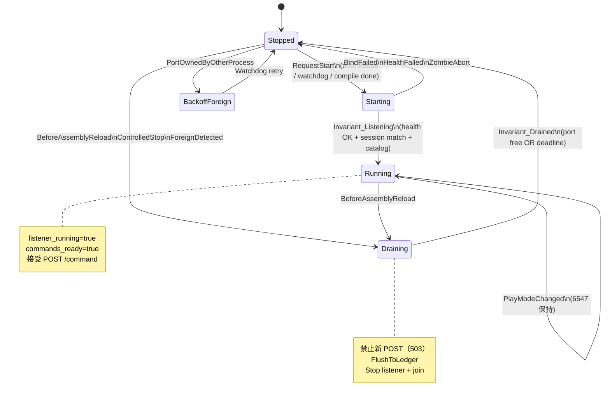

# Editor HTTP Server 可靠性架构方案（完整版）

**版本：** 0.2  
**日期：** 2026-06-04  
**范围：** `com.air.unity-connector`（Editor :6547）+ `unity-cmd`  
**读者：** 实现者、Agent 门禁、Code Review

---

## 0. 关于「确定保证」——请先读这一节

**不能承诺：** 在任何 Windows/Unity 版本、任意疯狂连点 Play/编译下 **永远零 warning、零失败**。OS 端口 `TIME_WAIT`、Unity 主线程卡顿、用户多开 Editor、杀毒软件劫持 loopback，都属于**环境层**，代码只能做到**可检测、可恢复、可解释**。

**可以承诺（实现 P0–P2 并通过验收测试后）：**

| 级别 | 承诺内容 |
|------|----------|
| **L1 不变式** | Supervisor 在任意时刻处于且仅处于一种**监督相位**；非法转移被拒绝或合并 |
| **L2 协议** | 非 `Running+Ready` 时，新 `POST /command` **必定** `503 reloading`（非挂死） |
| **L3 恢复** | 单次域重载后，在 T≤30s 内（无 compile error、单实例 6547）恢复到 `commands_ready=true`，或进入**明确** `ForeignPort` / `CompileErrors` 终态 |
| **L4 CLI** | `wait` 在就绪前不长时间空转；`NO_INSTANCE` **必定**带 `diagnostics.reason` |
| **L5 可观测** | 过渡期端口冲突**不刷** Warning 风暴；僵死端口有 `health_timeout` 与恢复动作 |

**当前仓库（仅补丁、未做 P0 Supervisor）≈ 达到 L4 一部分 + L5 一部分，未达 L1/L3。**  
因此：**你会仍偶发看到问题，直到 P0 合入并用 §8 测试跑绿。**

---

## 1. 你遇到的三类现象 —— 根因链

```text
[触发] 连续 Script Compile / Enter-Exit Play / Domain Reload
    │
    ├─► A. beforeAssemblyReload → Stop 未完成 / 端口仍 LISTENING
    │       └─► TryStart →「套接字只允许使用一次」×8 → Warning
    │
    ├─► B. 僵死：端口通、/health 不响应（listener 线程已停，OS 未释端口）
    │       └─► unity-cmd ping 长时间超时 → NO_INSTANCE（已用 diagnostics 缩短）
    │
    └─► C. 多入口 RequestEnsureRunning 竞态（watchdog + afterReload + play + compile）
            └─► 重叠 TryStart / 状态标志不一致（ListenerActive vs 实际端口）
```

**本质：** 不是缺缓存，而是缺 **「监督相位」单写者 + 停止后可验证 + 启动前排他」**。

已有缓存（实现良好、应保留）：

| 缓存 | 路径 | 作用 |
|------|------|------|
| Listener | `~/.unity-cmd/editor-http.json` | pid/session/generation/listener_id/status |
| 心跳 | `~/.unity-cmd/instances/{hash}.json` | CLI 无需 HTTP 即可判断 reloading/compile_errors |
| Job | `~/.unity-cmd/jobs/{project}/{id}.json` | deferred 命令跨域重载可查 |

---

## 2. 目标架构总览



**单一写者原则：** 只有 `EditorServerSupervisor` 可以 `Start/Stop` listener、改 `editor-http.status`、设 `ListenerActive`。`EditorConnectorBootstrap` 只做**事件转发**。

---

## 3. 监督相位 FSM（game-core `StateMachine`）

**采用：** `Air.GameCore.StateMachine`（**不**用 `ProcedureMachine`，避免与 GameDemo 流程混淆）。

**对外字符串**（`ConnectorPipelineState` / `/health`）由 `ConnectorStateEvaluator` 从 Supervisor 相位 + Unity 标志**推导**，不直接等于 FSM 类名。

### 3.1 状态与转移



### 3.2 各相位不变式（实现必须 assert/log）

| 相位 | `ListenerActive` | 端口 6547 | `editor-http.status` | 接受 POST |
|------|------------------|-----------|----------------------|-----------|
| **Stopped** | false | 应空闲* | stopped | 否 → 503 |
| **Draining** | false | 趋向空闲 | stopping→stopped | 否 → 503 |
| **Starting** | false→true | 绑定中 | stopped→running | 否 → 503 |
| **Running** | true | 监听中 | running | 是（scheduler 单飞） |
| **BackoffForeign** | false | 他进程占用 | stopped | 否 |

\*「应空闲」= `!PortReachability.IsPortOpen` 或记录 `ZombiePort` 并进入恢复子流程（见 §3.3）。

### 3.3 关键流程（解决 A/B/C）

**Draining（解决 A、C）**

1. `Interlocked` 或 `lock`：若已是 Draining/Starting，**合并**重复请求，不并行第二次 Stop/Start。
2. `ListenerActive = false`（立刻 503）。
3. `EditorJobStateManager.FlushToLedger()`。
4. `HttpListenerHost.Stop()`：**先** `listener.Stop/Close`，**再** join 线程（已实现）。
5. 轮询 `WaitUntilFree(port, max 3000ms)`；写 `editor-http` stopped + `instances` reloading。
6. 仅当进入 **Stopped** 才允许下一次 **Starting**。

**Starting（解决 A、B）**

1. 仅在 **Stopped** 进入；`PrepareForStart` 处理 foreign/session 对账。
2. **一次** `TryStart` 序列（内部地址占用：有限重试 + `WaitUntilFree 1500ms`，**禁止** 8 次 Warning 连打——失败则回 Stopped + 过渡期静默日志）。
3. Health 必须：`ok`、`host=editor`、`session_id` 匹配、`listener_running=true`。
4. `WarmCatalog` → `commands_ready=true`。
5. `EditorJobStateManager.Reload()` + **P1 orphan 策略**（§4）。
6. 写 running + `NotifyHttpServing`。

**僵死恢复（解决 B）**

- 条件：`IsPortOpen && !HealthOkWithin(1500ms) && status==stopped`。
- 动作：再执行一次 Draining 序列；仍失败 → `ZombiePort` 写入 instances，`LogConnectorError` 仅 readiness（非 Warning）。
- CLI：`diagnostics.reason=health_timeout`。

**事件源（解决 C）—— 全部改为 `supervisor.Enqueue(Event)`**

| 事件 | 行为 |
|------|------|
| `beforeAssemblyReload` | `Transition(Draining)` |
| `afterAssemblyReload` | `Transition(Starting)`（delay 1–2 帧） |
| `compilationFinished` | 若相位 Stopped/Starting 失败过 → `Starting` |
| `playMode Exiting*` | 仅 `MarkTransitionWindow`（2s 内不 Starting） |
| `playMode Entered*` | delay 8 帧 → `Starting` 若未 Running |
| `watchdog 2s` | 若相位应为 Running 但 health 失败 → `Starting` |

**禁止：** watchdog 与 afterReload 同时跑两套 `EnsureRunningLocked`（现网的竞态源）。

---

## 4. 请求恢复语义（「还原之前的请求」）

| 类型 | 重载后 | Agent 应做 |
|------|--------|------------|
| Deferred + `command_id` | Ledger 保留；policy 可补完 `compile` | 继续 `GET /commands/{id}` |
| Deferred 无 policy、仍 Running | **P1：** 标 `orphaned` | 读状态后决定是否重发 POST |
| Sync、无 id | **不恢复** | `wait` 后重发 POST |
| POST 遇 503 reloading | 未入队 | CLI `allow_connection_retry` 至超时 |

**绝不实现：** 按 `command_id` 重新执行 handler（避免双倍 play/compile）。

---

## 5. unity-cmd 契约（与 Unity 对称）

### 5.1 门禁（GameDemo Agent）

```text
1. unity-cmd --profile editor wait --timeout=120000
2. unity-cmd --profile editor ping   → ok:true
3. list / compile / menu / play ...
```

### 5.2 `wait` 就绪条件（与 Unity Running 对齐）

同时满足：

1. `instances`：`listener_running=true`，`commands_ready=true`，`connector_state=ready`，`compile_errors=false`。
2. `editor-http.json`：`status=running`，`pid` 为当前 Unity，`session_id/generation` 与 `/health` 一致。
3. `GET /health`：`ok`，`commands_ready=true`，host 匹配 profile。

**重载期间：** `wait` 阻塞轮询，**不**用 20s×N 单次 health 占满 timeout（`RESOLVE_TARGET_HEALTH_TIMEOUT_MS` + 快速失败路径）。

### 5.3 `diagnostics.reason` 枚举（与 Supervisor 对齐）

| reason | 含义 | 用户动作 |
|--------|------|----------|
| `port_closed` | 无监听 | 打开工程 / 检查端口 |
| `listener_restarting` | Draining/Starting | 等待或 `wait` |
| `editor_compiling` | 编译中 | 等待编译结束 |
| `compile_errors` | 脚本错误 | 修 Console |
| `health_timeout` | 僵死端口 | 聚焦 Editor 或重启 |
| `host_mismatch` / `foreign_process` | 多实例占端口 | 关其他 Unity 或改端口 |
| `not_ready` | catalog 未热身 | 短等再 `wait` |

---

## 6. 与现有补丁的关系

| 已合入补丁 | 作用 | 未覆盖 |
|------------|------|--------|
| Stop 先 Close listener | 缓解 A | 无单写者仍会竞态 |
| WaitForPort + 过渡期静默日志 | 缓解 A、Warning | 无 Draining 不变式 |
| `wait` / `diagnostics` / 探测 cap | 缓解 B、CLI | 不修复僵死恢复 |
| `compilationFinished` defer | 缓解 C | 与 watchdog 仍可能重叠 |

**结论：补丁是 P0 的预工作，不能替代 Supervisor。**

---

## 7. 实施路线与验收（必须跑绿才算「可靠」）

### P0 — EditorServerSupervisor（阻塞「可靠」宣称）

- [ ] `EditorServerSupervisor : StateMachine` + 相位枚举 + 事件队列（单写者锁）
- [ ] Bootstrap 瘦身为钩子转发
- [ ] Draining/Starting 实现 §3.2 不变式
- [ ] 移除并行 `EnsureRunningLocked` 路径
- [ ] 集成测试 `editor-lifecycle` 扩展：
  - 连续 5 次 `refresh compile=true` 域重载
  - Play → Stop Play → Edit 循环 3 次
  - 每次后 `wait` + `ping` + `echo` 成功

### P1 — Job 终态（CONN-04）

- [ ] 重载后非 terminal 且无 policy → `orphaned`
- [ ] `GET /commands/{id}` 返回明确 JSON
- [ ] CLI 集成：`compile` 跨重载 poll 成功或 orphaned

### P2 — 缓存 schema v2 + 僵死检测

- [ ] `editor-http` 增加 `phase`, `last_error`, `project_path`
- [ ] `state` 命令暴露 supervisor 相位（调试）

### P3 — 可选 `connector restart` 命令

---

## 8. 边界场景矩阵（方案必须覆盖）

| # | 场景 | 预期行为 | 验证方式 |
|---|------|----------|----------|
| 1 | 单次域重载 | ≤30s 恢复 Running | integration |
| 2 | 连续快速编译 5 次 | 无 Warning 风暴；最终可 echo | integration stress |
| 3 | 连点 Play 5 次 | 6547 仍可用或明确 defer | manual + integration |
| 4 | compile_errors | 不 Running；diagnostics 指明 | ping JSON |
| 5 | 双 Unity 占 6547 | BackoffForeign；hint 明确 | 第二实例 |
| 6 | 重载中 CLI deferred compile | 503→retry→成功 | unity-cmd |
| 7 | 重载中 CLI sync menu | 失败后 wait+重试成功 | unity-cmd |
| 8 | 杀进程残留端口 | ZombiePort→Draining→恢复或明确失败 | 模拟 |
| 9 | `GET /commands/id` 跨重载 | compile 完成或 orphaned | P1 |

---

## 9. game-core 状态机（§3 已采用）

- **用** `StateMachine` + 自定义 `State` 子类。
- **不用** `ProcedureMachine`（游戏语义）。
- `OnEnter` 仅排队 `delayCall`，长操作用 Starting 子步骤状态或异步回调，**禁止阻塞主线程**。

---

## 10. 对你两个问题的直接回答

**Q：采用 game-core 状态机可以吗？**  
**A：可以，且推荐；依赖已存在。必须实现为 Supervisor 单写者，而不是给 Bootstrap 再贴 if。**

**Q：能保证不再出现之前的问题吗？**  
**A：在 §0 的 L1–L5 范围内、§8 测试通过后，可以认为**工程上可靠**。未实现 P0 前，请继续用 `wait` + 修 compile errors，并预期偶发 Warning。实现 P0 后若 §8 仍失败，视为 **bug**，按相位日志修。

---

## 11. 相关文档

| 文档 | 路径 |
|------|------|
| Connector 实现 | `com.air.unity-connector/docs/IMPLEMENTATION.md` |
| CLI 架构 | `docs/ARCHITECTURE.md` |
| TODO | `docs/TODO.md`（CONN-07 P0） |

---

*本文档为实现验收的单一事实来源；版本 0.2 起以 §8 测试为「可靠」判定依据。*
